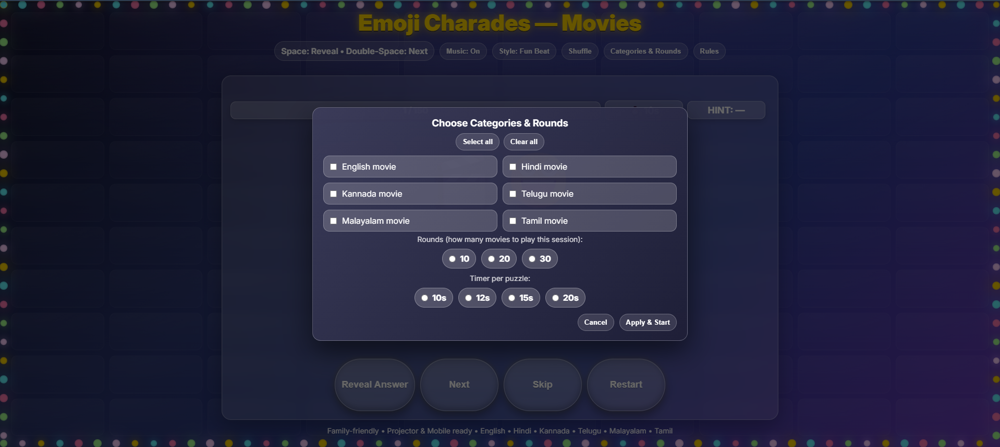
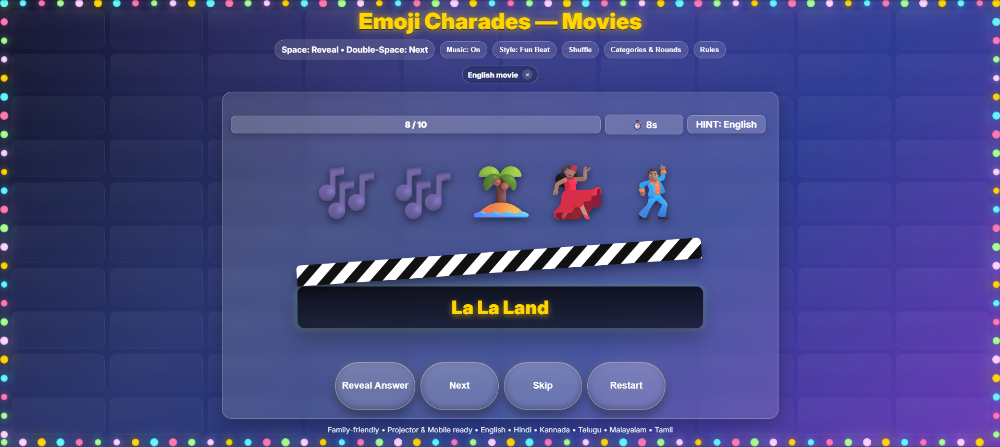

# Emoji Charades — Movies 😍🥰⭐👍😊😉

A family-friendly, projector-ready **emoji movie guessing game**.  
Pick one or more categories (English / Hindi / Kannada / Telugu / Malayalam / Tamil), choose how many movies to play (10 / 20 / 30 / 50), and let the 12-second timer begin. Reveal with **Space**, go **Next** with **double-Space**. Includes confetti, soft celebration claps, ambient background music, and responsive UI for phones and large screens

**Live demo (GitHub Pages):**  
[Play Emoji Charades](https://mandeepkoursardarni.github.io/Emoji-movies-charades/)

## Preview

  
    
  

---

## Features
- 🎭 **Emoji puzzles** for popular movies across 6 languages.  
- 🗂️ **Categories & Rounds** modal: choose languages and 10/20/30/50 rounds.  
- ⏱️ **12s timer** per puzzle with clear visual cues.  
- ⌨️ **Controls**:  
  - **Space** → Reveal answer  
  - **Double-Space** → Next puzzle  
- 🎉 **Confetti + soft claps** on reveal (pleasant in halls/laptops).  
- 🎵 **Ambient background music** with on/off toggle.  
- 🔀 **Shuffle** and **Restart** buttons.  
- 📱 **Responsive** design (mobile, tablet, projector).

---

## How to Run Locally
Just open the file in a browser:
1. Download/clone this repository.  
2. Double-click `index.html` to open in Chrome/Edge/Firefox/Safari.

> Note: Browsers may block audio auto-play until the first click. As soon as you click anywhere, sound will work.

---

## How to Play
1. On load, the **Categories & Rounds** popup appears. Select languages and how many rounds to play, then click **Apply & Start**.  
2. Guess the movie from the emojis before the **12s timer** ends.  
3. Press **Space** (or click **Reveal Answer**) to show the answer on the clapper.  
4. **Double-Space** (or click **Next/Skip**) to move to next puzzle.  
5. Use **Shuffle** anytime to reshuffle the order for a new run.

---

## Controls Summary
- **Space** → Reveal answer  
- **Double-Space** → Next puzzle  
- Buttons: Reveal Answer, Next, Skip, Restart, Shuffle, Music On/Off, Categories & Rounds, Rules

---

## Files
- `index.html` — the entire app (HTML + CSS + JS).  
- `screenshot.png` — optional screenshot for the repo.

---

## Deploy to GitHub Pages
1. Push this repo to GitHub.  
2. Go to **Settings → Pages**.  
3. Under **Source**, choose **Deploy from a branch** → `main` branch → `/ (root)`.  
4. Save. After a short build, your site appears at:  
   [https://mandeepkoursardarni.github.io/Emoji-movies-charades/](https://mandeepkoursardarni.github.io/Emoji-movies-charades/)

---

## Notes
- This project has **no license** by default (all rights reserved).  
- Audio is synthesized via Web Audio API (no external audio files), so works offline once opened.

---

## Credits
- UX and code crafted for group fun: parties, classrooms, and quick office sessions.  
- Emoji art uses standard Unicode emojis supported by modern browsers.

Enjoy! 🎬✨

## Features
- 🎭 **Emoji puzzles** for popular movies across 6 languages.  
- 🗂️ **Categories & Rounds** modal: choose languages and 10/20/30/50 rounds.  
- ⏱️ **12s timer** per puzzle with clear visual cues.  
- ⌨️ **Controls**:  
  - **Space** → Reveal answer  
  - **Double-Space** → Next puzzle  
- 🎉 **Confetti + soft claps** on reveal (pleasant in halls/laptops).  
- 🎵 **Ambient background music** with on/off toggle.  
- 🔀 **Shuffle** and **Restart** buttons.  
- 📱 **Responsive** design (mobile, tablet, projector).

---

## How to Run Locally
Just open the file in a browser:
1. Download/clone this repository.  
2. Double-click `index.html` to open in Chrome/Edge/Firefox/Safari.

> Note: Browsers may block audio auto-play until the first click. As soon as you click anywhere, sound will work.

---

## How to Play
1. On load, the **Categories & Rounds** popup appears. Select languages and how many rounds to play, then click **Apply & Start**.  
2. Guess the movie from the emojis before the **12s timer** ends.  
3. Press **Space** (or click **Reveal Answer**) to show the answer on the clapper.  
4. **Double-Space** (or click **Next/Skip**) to move to next puzzle.  
5. Use **Shuffle** anytime to reshuffle the order for a new run.

---

## Controls Summary
- **Space** → Reveal answer  
- **Double-Space** → Next puzzle  
- Buttons: Reveal Answer, Next, Skip, Restart, Shuffle, Music On/Off, Categories & Rounds, Rules

---

## Files
- `index.html` — the entire app (HTML + CSS + JS).  
- `screenshot.png` — optional screenshot for the repo.

---

## Deploy to GitHub Pages
1. Push this repo to GitHub.  
2. Go to **Settings → Pages**.  
3. Under **Source**, choose **Deploy from a branch** → `main` branch → `/ (root)`.  
4. Save. After a short build, your site appears at:  
   [https://mandeepkoursardarni.github.io/Emoji-movies-charades/](https://mandeepkoursardarni.github.io/Emoji-movies-charades/)

---

## Notes
- This project has **no license** by default (all rights reserved).  
- Audio is synthesized via Web Audio API (no external audio files), so works offline once opened.

---

## Credits
- UX and code crafted for group fun: parties, classrooms, and quick office sessions.  
- Emoji art uses standard Unicode emojis supported by modern browsers.

Enjoy! 🎬✨

